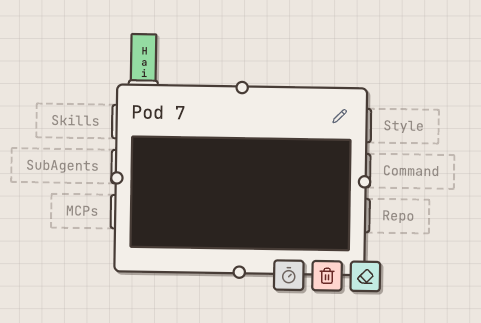
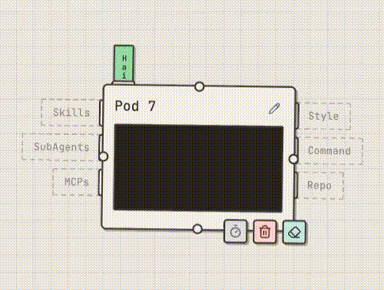
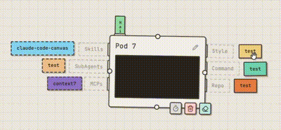

[繁體中文](README.md)

# Claude Code Canvas

A canvas tool for visually designing and executing AI Agent workflows, powered by Claude Agent SDK for agent execution. Also supports team collaboration.

## Table of Contents

- [Important Notes](#important-notes)
- [Installation](#installation)
- [Getting Started](#getting-started)
- [Environment Variables](#environment-variables)
- [Tutorials](#tutorials)
  - [What is a POD?](#what-is-a-pod)
  - [How to Switch Models?](#how-to-switch-models)
  - [Slot Overview](#slot-overview)

## Important Notes

- This project is currently in **Alpha**. Features and UI may change significantly.
- Recommended for **local environment** use only, not recommended for cloud deployment (no user authentication is implemented).
- Since it uses the **Claude Agent SDK**, make sure the service runs in an environment where **Claude is already logged in**. Not supported API Key now.
- Currently **only tested on macOS**. Other operating systems may have unknown issues.
- Canvas data is stored in `~/Documents/ClaudeCanvas`

## Installation

**Prerequisites:** Bun

```bash
cd frontend && bun install
cd backend && bun install
```

## Getting Started

**Frontend**

```bash
cd frontend && bun run dev
```

Runs on port 5173.

**Backend**

```bash
cd backend && bun run dev
```

Runs on port 3001.

**Production**

```bash
cd backend && bun run prod
```

Builds the frontend and serves everything together from the backend.

## Environment Variables

To use Clone features for accessing private repositories, create a `.env` file in the `backend/` directory:

```bash
# GitHub Token for accessing private repositories
GITHUB_TOKEN=ghp_xxxxx

# GitLab Token for accessing private repositories (supports GitLab.com and self-hosted)
GITLAB_TOKEN=glpat-xxxxx

# Self-hosted GitLab URL (optional, defaults to gitlab.com)
GITLAB_URL=https://gitlab.example.com
```

## Tutorials

### What is a POD?

- A Pod = Claude Code
- Right-click on the canvas → Pod to create one



### How to Switch Models?

- Hover over the model label on top of the Pod to select Opus / Sonnet / Haiku



### Slot Overview

- Skills / SubAgents can hold multiple items
- Style (Output Style) / Command (Slash Command) / Repo can only hold one
- Command will automatically prepend to your message, e.g., `/command message`
- Repo changes the working directory; without one, the Pod uses its own directory


