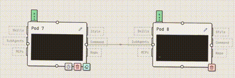

[English](README.en.md) | [日本語](README.ja.md)

# Claude Code Canvas

視覺化設計與執行 AI Agent 工作流程的畫布工具，串接 Claude Agent SDK 驅動 Agent 執行，也可支援團隊多人協作。

<video src="https://github.com/user-attachments/assets/58a82eb0-e629-46cc-a944-5ba891692b52" controls width="100%"></video>

## 目錄

- [注意事項](#注意事項)
- [安裝](#安裝)
- [使用方式](#使用方式)
- [設定](#設定)
- [教學](#教學)
  - [什麼是 POD？](#什麼是-pod)
  - [如何切換模型？](#如何切換模型)
  - [Slot 說明](#slot-說明)
  - [Connection Line](#connection-line)

## 注意事項

- 目前還在 **Alpha 版本**，功能與介面可能會有較大變動
- 建議在 **Local 環境** 使用，不建議部署到雲端（本工具目前沒有使用者認證機制）
- 因為使用 **Claude Agent SDK**，請確保此服務啟動在**已登入 Claude 的環境**，暫時不支援 API Key
- 目前**僅在 macOS 上測試過**，其他作業系統可能會有未知問題
- 畫布資料會存放在 `~/Documents/ClaudeCanvas`
- 目前是以**最大權限**開放給 AI，請小心操作

## 安裝

**前提條件：** [Claude Code](https://docs.anthropic.com/en/docs/claude-code) 已安裝並登入

**一鍵安裝（推薦）**

```bash
curl -fsSL https://raw.githubusercontent.com/cowbear6598/claude-code-canvas/main/install.sh | sh
```

**解除安裝**

```bash
curl -fsSL https://raw.githubusercontent.com/cowbear6598/claude-code-canvas/main/install.sh | sh -s -- --uninstall
```

## 使用方式

```bash
# 啟動服務（背景 daemon 模式，預設 port 3001）
claude-canvas start

# 指定 port 啟動
claude-canvas start --port 8080

# 查看服務狀態
claude-canvas status

# 停止服務
claude-canvas stop

# 查看最新日誌（預設 50 行）
claude-canvas logs

# 查看指定行數的日誌
claude-canvas logs -n 100
```

啟動後開啟瀏覽器前往 `http://localhost:3001` 即可使用。

## 設定

如果要使用 Clone 相關功能存取私有 Repository，請使用 `config` 指令設定。如果已經使用 `gh` 登入過，理論上可以不需要額外填寫 GitHub Token。

```bash
# GitHub Token
claude-canvas config set GITHUB_TOKEN ghp_xxxxx

# GitLab Token
claude-canvas config set GITLAB_TOKEN glpat-xxxxx

# 自架 GitLab 網址（選填，預設為 gitlab.com）
claude-canvas config set GITLAB_URL https://gitlab.example.com

# 查看所有設定
claude-canvas config list
```

## 教學

### 什麼是 POD？

- 一個 Pod = Claude Code
- 右鍵畫布 → Pod 即可建立


### 如何切換模型？

- 移動到 Pod 上方的模型標籤，就可以選擇 Opus / Sonnet / Haiku


### Slot 說明

- Skills / SubAgents / MCPs 可以放入多個
- Style（Output Style）/ Command（Slash Command）/ Repo 只能單個
- Command 會讓你的訊息前方自動加入，例如：`/command message`
- Repo 會更改你的工作目錄，沒有放入則是 Pod 自己的目錄


### Connection Line

- Auto：不管怎樣都會往下一個 Pod 執行
- AI：會交由 AI 判斷有沒有需要往下一個 Pod 執行
- Direct：不理會其他 Connection Line 直接執行



#### 多條觸發規則

當 Pod 被多條 Connection Line 接入：

- Auto + Auto = 當兩條都準備好時，則會觸發 Pod
- Auto + AI = 當 AI 拒絕時，則不會觸發，同意時，則會觸發 Pod
- Direct + Direct = 當一條完成時，會等 10 秒看其他 Direct 是否完成，如果完成則一起做總結觸發 Pod，等不到的話則會各自總結
- Auto + Auto + Direct + Direct = 會分成兩組（Auto 組與 Direct 組）去做總結，哪一條先完成則會先觸發那組，另一組則會進入 queue 等待觸發
