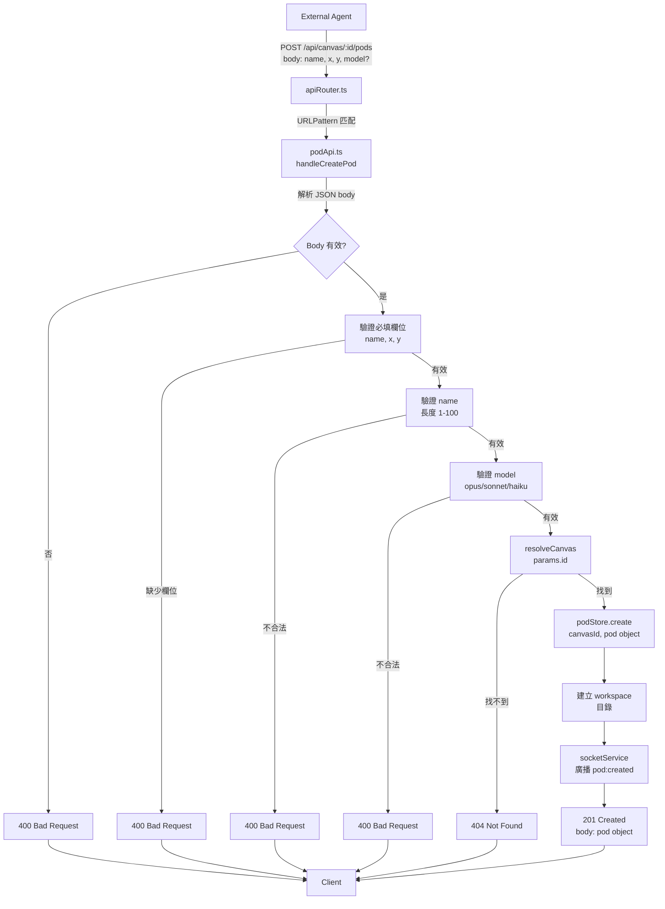

# 透過 REST API 建立 Pod

## 流程說明

| 步驟 | 說明 |
|------|------|
| 1 | 外部 Agent 發送 POST 請求到 `/api/canvas/:id/pods`，攜帶 name、x、y、model（選擇性） |
| 2 | apiRouter.ts 使用 URLPattern 解析 URL，提取 canvasId 路徑參數，匹配到對應 handler |
| 3 | podApi.ts 中的 handleCreatePod 解析 JSON body |
| 4 | 若 body 解析失敗，回傳 400 Bad Request |
| 5 | 驗證必填欄位 name、x、y，若缺少則回傳 400 |
| 6 | 驗證 name 長度在 1-100 之間，不合法則回傳 400 |
| 7 | 驗證 model 值為 opus、sonnet 或 haiku（若提供），不合法則回傳 400 |
| 8 | 使用 resolveCanvas(params.id) 查詢 Canvas，找不到則回傳 404 |
| 9 | Canvas 存在，呼叫 podStore.create() 建立 Pod 物件 |
| 10 | 在檔案系統建立 workspace 目錄 |
| 11 | 透過 socketService 廣播 pod:created 事件給所有連線客戶端 |
| 12 | 回傳 201 Created + Pod 物件內容 |
