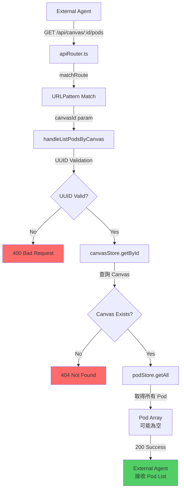

```mermaid
graph TD
    A["External Agent"] -->|GET /api/canvas/:id/pods| B["apiRouter.ts"]
    B -->|matchRoute| C["URLPattern Match"]
    C -->|canvasId param| D["handleListPodsByCanvas"]
    D -->|UUID Validation| E{UUID Valid?}
    E -->|No| F["400 Bad Request"]
    E -->|Yes| G["canvasStore.getById"]
    G -->|查詢 Canvas| H{Canvas Exists?}
    H -->|No| I["404 Not Found"]
    H -->|Yes| J["podStore.getAll"]
    J -->|取得所有 Pod| K["Pod Array<br/>可能為空"]
    K -->|200 Success| L["External Agent<br/>接收 Pod List"]

    style F fill:#ff6b6b
    style I fill:#ff6b6b
    style L fill:#51cf66
```
