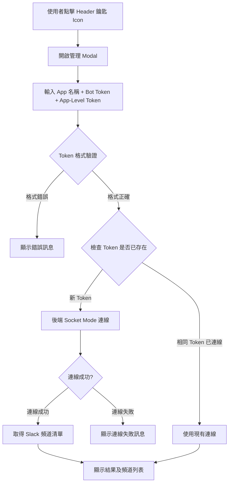
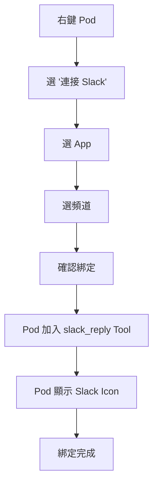
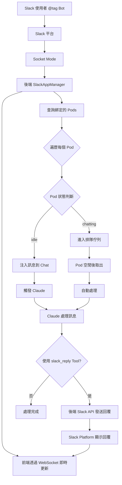
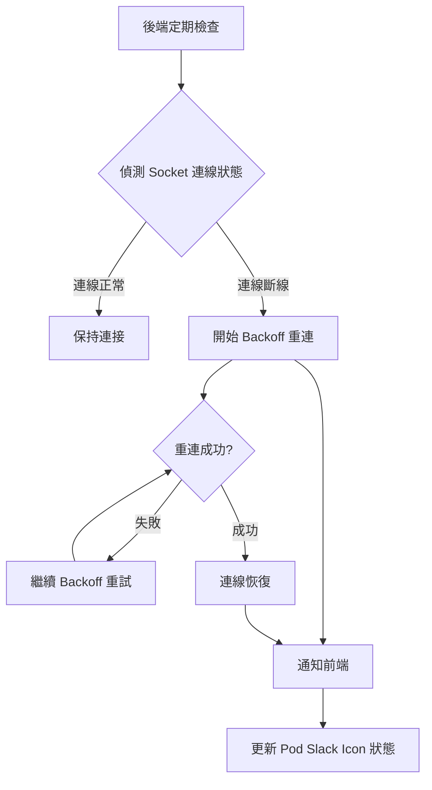

# Slack App 註冊與連線流程



# Pod 綁定 Slack 流程



# Slack 訊息接收與處理流程



# 連線健康檢查流程



# 完整資料流向圖

```mermaid
graph TB
    subgraph SlackPlatform["Slack Platform"]
        A[Slack 使用者]
        B[Slack API]
    end

    subgraph Backend["後端"]
        C[SlackAppManager]
        D[Socket Mode Client]
        E[Pod Chat Manager]
    end

    subgraph PodRuntime["Pod Runtime"]
        F[Pod Chat]
        G[Claude Agent SDK]
        H["slack_reply MCP Tool"]
    end

    subgraph Frontend["前端"]
        I["UI 元件"]
    end

    A -->|@tag Bot| B
    B --> D
    D --> C
    C --> E
    E --> F
    F --> G
    G --> H
    H --> C
    C --> B
    B --> A
    C -->|WebSocket 狀態更新| I
    D -->|連線狀態| C
```
