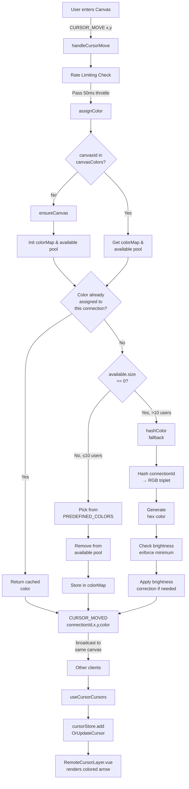
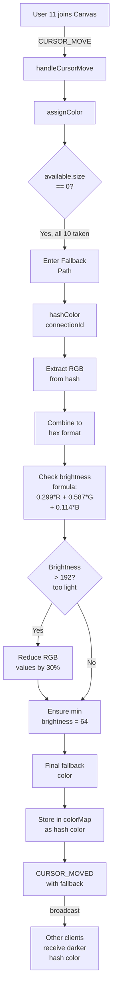
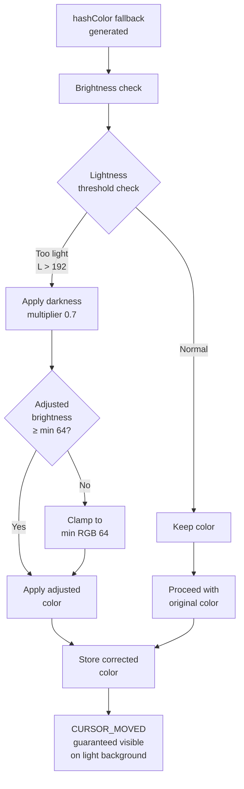
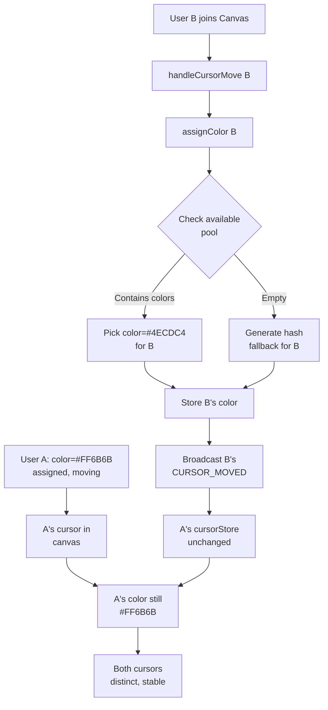
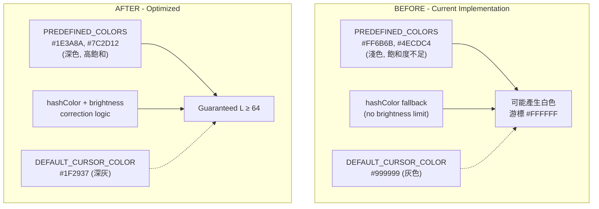
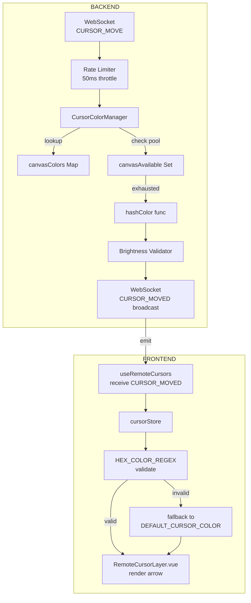

# Userflow 1：10 人以內 - 預設顏色池分配

```mermaid
graph TD
    A["User enters Canvas"] -->|CURSOR_MOVE x,y| B["handleCursorMove"]
    B --> C["Rate Limiting Check"]
    C -->|Pass 50ms throttle| D["assignColor"]
    D --> E{"canvasId in<br/>canvasColors?"}
    E -->|No| F["ensureCanvas"]
    F --> G["Init colorMap & available pool"]
    E -->|Yes| H["Get colorMap &<br/>available pool"]
    G --> I{"Color already<br/>assigned to<br/>this connection?"}
    H --> I
    I -->|Yes| J["Return cached<br/>color"]
    I -->|No| K{"available.size<br/>== 0?"}
    K -->|No, ≤10 users| L["Pick from<br/>PREDEFINED_COLORS"]
    L --> M["Remove from<br/>available pool"]
    M --> N["Store in colorMap"]
    K -->|Yes, >10 users| O["hashColor<br/>fallback"]
    O --> P["Hash connectionId<br/>→ RGB triplet"]
    P --> Q["Generate<br/>hex color"]
    N --> R["CURSOR_MOVED<br/>connectionId,x,y,color"]
    Q --> S["Check brightness<br/>enforce minimum"]
    J --> R
    S --> T["Apply brightness<br/>correction if needed"]
    T --> R
    R -->|broadcast to<br/>same canvas| U["Other clients"]
    U --> V["useCursorCursors"]
    V --> W["cursorStore.add<br/>OrUpdateCursor"]
    W --> X["RemoteCursorLayer.vue<br/>renders colored arrow"]
```

# Userflow 2：超過 10 人 - Fallback 顏色生成

```mermaid
graph TD
    A["User 11 joins Canvas"] -->|CURSOR_MOVE| B["handleCursorMove"]
    B --> C["assignColor"]
    C --> D{"available.size<br/>== 0?"}
    D -->|Yes, all 10 taken| E["Enter Fallback<br/>Path"]
    E --> F["hashColor<br/>connectionId"]
    F --> G["Extract RGB<br/>from hash"]
    G --> H["Combine to<br/>hex format"]
    H --> I["Check brightness<br/>formula:<br/>0.299*R + 0.587*G<br/>+ 0.114*B"]
    I --> J{"Brightness<br/>> 192?<br/>too light"}
    J -->|Yes| K["Reduce RGB<br/>values by 30%"]
    K --> L["Ensure min<br/>brightness = 64"]
    J -->|No| L
    L --> M["Final fallback<br/>color"]
    M --> N["Store in colorMap<br/>as hash color"]
    N --> O["CURSOR_MOVED<br/>with fallback"]
    O -->|broadcast| P["Other clients<br/>receive darker<br/>hash color"]
```

# Userflow 3：無效或極端顏色自動修正

```mermaid
graph TD
    A["hashColor fallback<br/>generated"] --> B["Brightness check"]
    B --> C{"Lightness<br/>threshold check"}
    C -->|Too light<br/>L > 192| D["Apply darkness<br/>multiplier 0.7"]
    C -->|Normal| E["Keep color"]
    D --> F{"Adjusted<br/>brightness<br/>≥ min 64?"}
    F -->|No| G["Clamp to<br/>min RGB 64"]
    F -->|Yes| H["Apply adjusted<br/>color"]
    G --> H
    E --> I["Proceed with<br/>original color"]
    H --> J["Store corrected<br/>color"]
    I --> J
    J --> K["CURSOR_MOVED<br/>guaranteed visible<br/>on light background"]
```

# Userflow 4：新人加入不影響既有使用者

```mermaid
graph TD
    A["User A: color=#FF6B6B<br/>assigned, moving"] --> B["A's cursor in<br/>canvas"]
    C["User B joins Canvas"] --> D["handleCursorMove B"]
    D --> E["assignColor B"]
    E --> F{"Check available<br/>pool"}
    F -->|Contains colors| G["Pick color=#4ECDC4<br/>for B"]
    F -->|Empty| H["Generate hash<br/>fallback for B"]
    G --> I["Store B's color"]
    H --> I
    I --> J["Broadcast B's<br/>CURSOR_MOVED"]
    J --> K["A's cursorStore<br/>unchanged"]
    B --> L["A's color still<br/>#FF6B6B"]
    K --> L
    L --> M["Both cursors<br/>distinct, stable"]
```

# 優化前後對比架構

```mermaid
graph TB
    subgraph Before["BEFORE - Current Implementation"]
        B1["PREDEFINED_COLORS<br/>#FF6B6B, #4ECDC4<br/>(淺色, 飽和度不足)"]
        B2["hashColor fallback<br/>(no brightness limit)"]
        B3["可能產生白色<br/>游標 #FFFFFF"]
        B4["DEFAULT_CURSOR_COLOR<br/>#999999 (灰色)"]
        B1 --> B3
        B2 --> B3
        B4 -.-> B3
    end

    subgraph After["AFTER - Optimized"]
        A1["PREDEFINED_COLORS<br/>#1E3A8A, #7C2D12<br/>(深色, 高飽和)"]
        A2["hashColor + brightness<br/>correction logic"]
        A3["Guaranteed L ≥ 64"]
        A4["DEFAULT_CURSOR_COLOR<br/>#1F2937 (深灰)"]
        A1 --> A3
        A2 --> A3
        A4 -.-> A3
    end
```

# 數據流：連線到顏色分配再到前端渲染

```mermaid
graph TD
    subgraph Backend["BACKEND"]
        WS1["WebSocket<br/>CURSOR_MOVE"]
        RateLimit["Rate Limiter<br/>50ms throttle"]
        ColorMgr["CursorColorManager"]
        Canvas["canvasColors Map"]
        Available["canvasAvailable Set"]
        Hash["hashColor func"]
        Brightness["Brightness Validator"]
        WS2["WebSocket<br/>CURSOR_MOVED broadcast"]

        WS1 --> RateLimit
        RateLimit --> ColorMgr
        ColorMgr -->|lookup| Canvas
        ColorMgr -->|check pool| Available
        Available -->|exhausted| Hash
        Hash --> Brightness
        Brightness --> WS2
    end

    subgraph Frontend["FRONTEND"]
        RCV["useRemoteCursors<br/>receive CURSOR_MOVED"]
        Store["cursorStore"]
        Regex["HEX_COLOR_REGEX<br/>validate"]
        Default["fallback to<br/>DEFAULT_CURSOR_COLOR"]
        Render["RemoteCursorLayer.vue<br/>render arrow"]

        RCV --> Store
        Store --> Regex
        Regex -->|valid| Render
        Regex -->|invalid| Default
        Default --> Render
    end

    WS2 -->|emit| RCV
```
