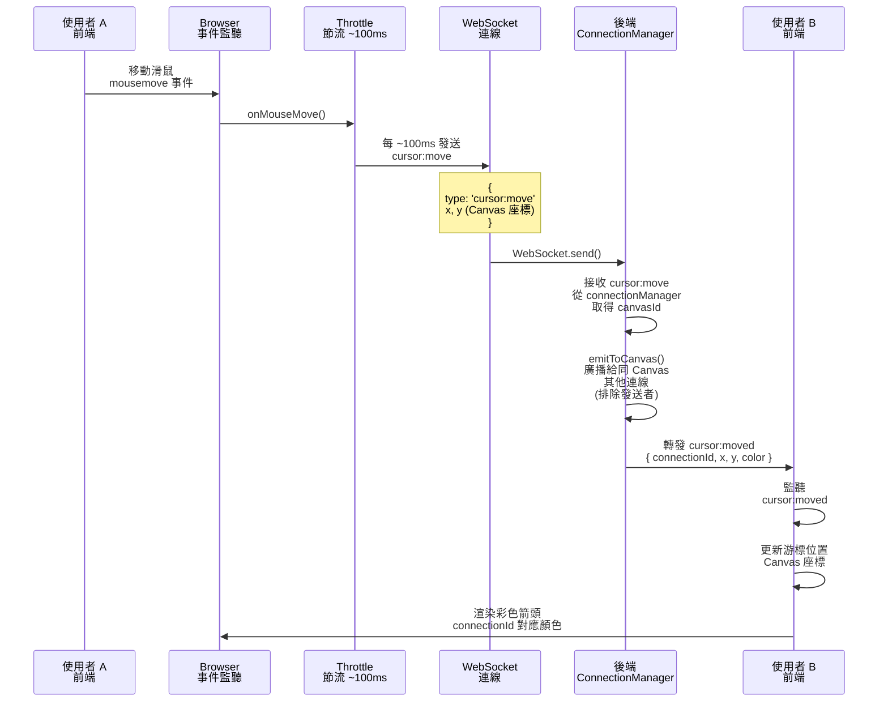
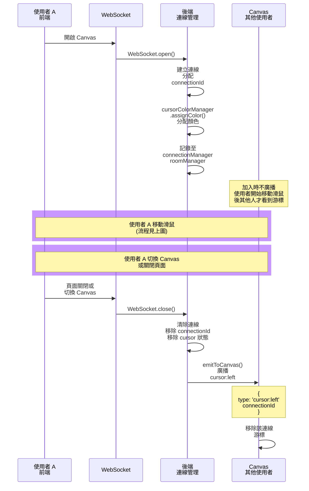
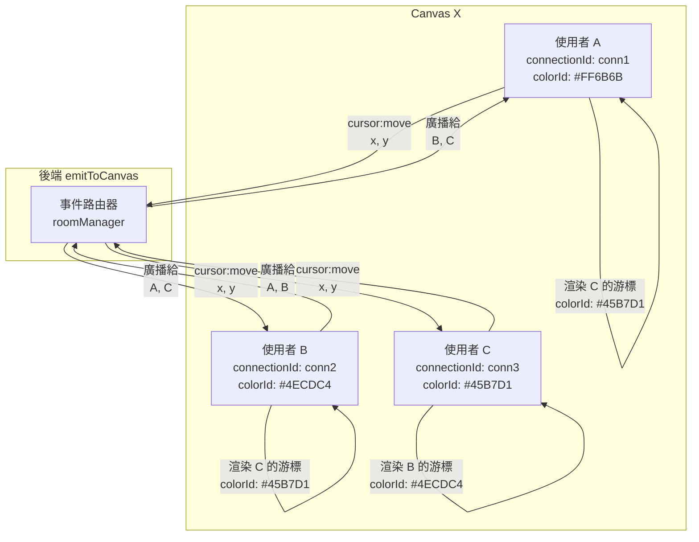
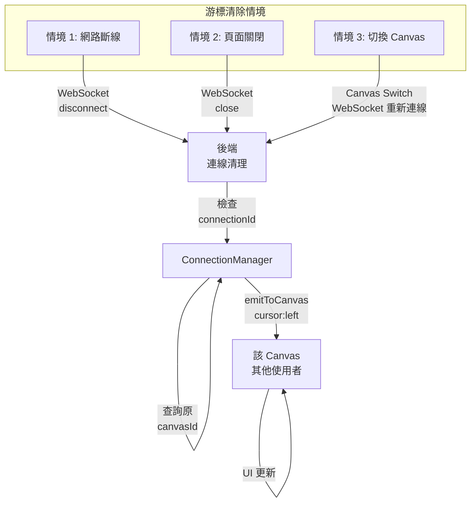

# 多人游標共享 - Mermaid 流程圖

## 游標位置資料流

```mermaid
sequenceDiagram
    participant UserA as 使用者 A<br/>前端
    participant Canvas as Browser<br/>事件監聽
    participant Throttle as Throttle<br/>節流 ~100ms
    participant WS as WebSocket<br/>連線
    participant Backend as 後端<br/>ConnectionManager
    participant UserB as 使用者 B<br/>前端

    UserA->>Canvas: 移動滑鼠<br/>mousemove 事件
    Canvas->>Throttle: onMouseMove()
    Throttle->>WS: 每 ~100ms 發送<br/>cursor:move
    Note over WS: {<br/>type: 'cursor:move'<br/>x, y (Canvas 座標)<br/>}
    WS->>Backend: WebSocket.send()
    Backend->>Backend: 接收 cursor:move<br/>從 connectionManager<br/>取得 canvasId
    Backend->>Backend: emitToCanvas()<br/>廣播給同 Canvas<br/>其他連線<br/>(排除發送者)
    Backend->>UserB: 轉發 cursor:moved<br/>{ connectionId, x, y, color }
    UserB->>UserB: 監聽<br/>cursor:moved
    UserB->>UserB: 更新游標位置<br/>Canvas 座標
    UserB->>Canvas: 渲染彩色箭頭<br/>connectionId 對應顏色
```

## 連線/斷線生命週期

```mermaid
sequenceDiagram
    participant UserA as 使用者 A<br/>前端
    participant WS as WebSocket
    participant Backend as 後端<br/>連線管理
    participant Canvas as Canvas<br/>其他使用者

    UserA->>WS: 開啟 Canvas
    WS->>Backend: WebSocket.open()
    Backend->>Backend: 建立連線<br/>分配<br/>connectionId
    Backend->>Backend: cursorColorManager<br/>.assignColor()<br/>分配顏色
    Backend->>Backend: 記錄至<br/>connectionManager<br/>roomManager
    Note over Canvas: 加入時不廣播<br/>使用者開始移動滑鼠<br/>後其他人才看到游標

    rect rgb(200, 150, 255)
    Note over UserA,Canvas: 使用者 A 移動滑鼠<br/>(流程見上圖)
    end

    rect rgb(200, 150, 255)
    Note over UserA,Canvas: 使用者 A 切換 Canvas<br/>或關閉頁面
    end

    UserA->>WS: 頁面關閉或<br/>切換 Canvas
    WS->>Backend: WebSocket.close()
    Backend->>Backend: 清除連線<br/>移除 connectionId<br/>移除 cursor 狀態
    Backend->>Canvas: emitToCanvas()<br/>廣播<br/>cursor:left
    Note over Canvas: {<br/>type: 'cursor:left'<br/>connectionId<br/>}
    Canvas->>Canvas: 移除該連線<br/>游標
```

## 多人協作場景（3人同時在線）

```mermaid
graph TB
    subgraph Canvas["Canvas X"]
        A["使用者 A<br/>connectionId: conn1<br/>colorId: #FF6B6B"]
        B["使用者 B<br/>connectionId: conn2<br/>colorId: #4ECDC4"]
        C["使用者 C<br/>connectionId: conn3<br/>colorId: #45B7D1"]
    end

    subgraph Backend["後端 emitToCanvas"]
        Router["事件路由器<br/>roomManager"]
    end

    A -->|cursor:move<br/>x, y| Router
    B -->|cursor:move<br/>x, y| Router
    C -->|cursor:move<br/>x, y| Router

    Router -->|廣播給<br/>B, C| A
    Router -->|廣播給<br/>A, C| B
    Router -->|廣播給<br/>A, B| C

    A -->|渲染 B 的游標<br/>colorId: #4ECDC4| A
    A -->|渲染 C 的游標<br/>colorId: #45B7D1| A

    B -->|渲染 A 的游標<br/>colorId: #FF6B6B| B
    B -->|渲染 C 的游標<br/>colorId: #45B7D1| B

    C -->|渲染 A 的游標<br/>colorId: #FF6B6B| C
    C -->|渲染 B 的游標<br/>colorId: #4ECDC4| C
```

## 游標清除流程

```mermaid
graph TB
    subgraph Scenarios["游標清除情境"]
        S1["情境 1: 網路斷線"]
        S2["情境 2: 頁面關閉"]
        S3["情境 3: 切換 Canvas"]
    end

    S1 -->|WebSocket<br/>disconnect| Handler["後端<br/>連線清理"]
    S2 -->|WebSocket<br/>close| Handler
    S3 -->|Canvas Switch<br/>WebSocket 重新連線| Handler

    Handler -->|檢查<br/>connectionId| CM["ConnectionManager"]
    CM -->|移除<br/>cursor 記錄| CM
    CM -->|查詢原<br/>canvasId| CM

    CM -->|emitToCanvas<br/>cursor:left| Canvas["該 Canvas<br/>其他使用者"]

    Canvas -->|移除該<br/>connectionId<br/>的游標| Canvas
    Canvas -->|UI 更新| Canvas
```
