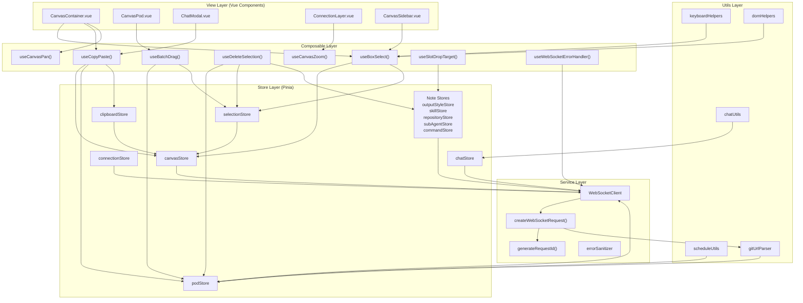
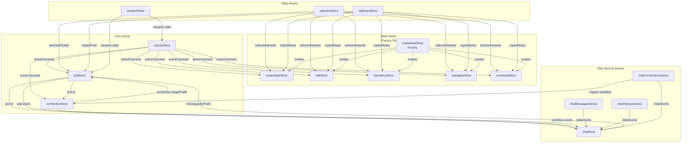
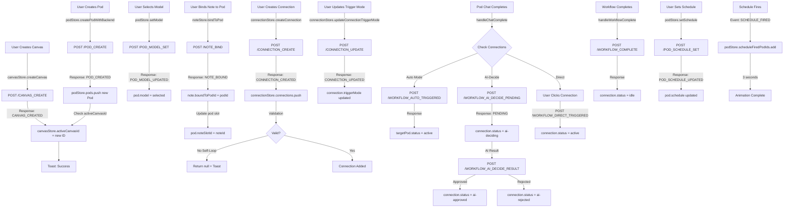
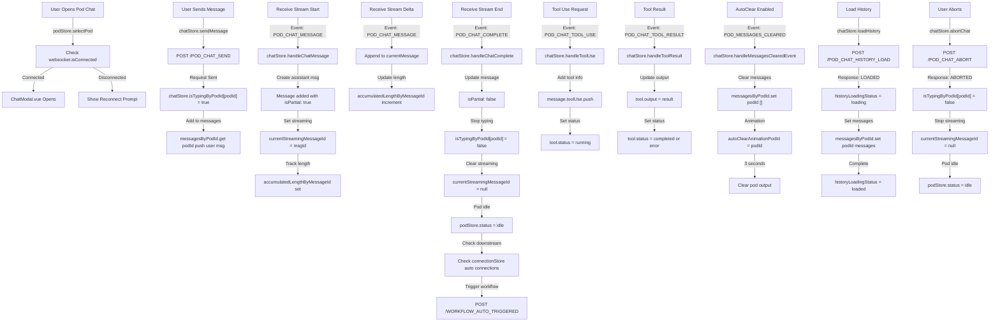
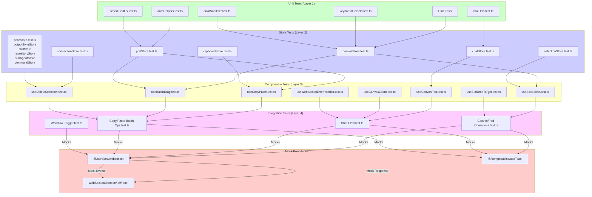
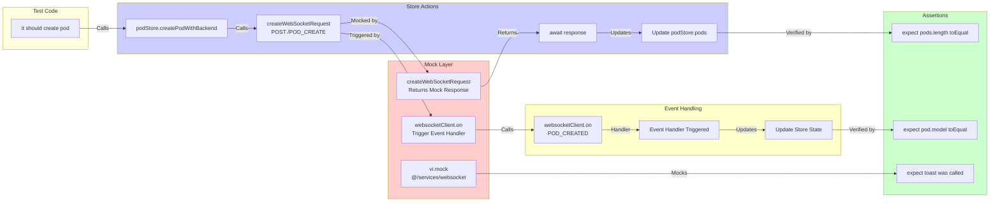

# Frontend Testing Architecture

## Diagram 1: Frontend Layered Architecture



---

## Diagram 2: Store Dependency Graph



---

## Diagram 3: User Flow 1 - Canvas/Pod/Connection Operations



---

## Diagram 4: User Flow 2 - Chat Conversation



---

## Diagram 5: User Flow 3 - Copy/Paste & Batch Operations

```mermaid
graph TD
    A["User Starts Box Select"] -->|useBoxSelect| B["selectionStore.startSelection"]
    B -->|Set flag| C["isSelecting = true"]
    C -->|Record Ctrl| D{Ctrl Pressed?}
    D -->|Yes| E["initialSelectedElements = save"]
    D -->|No| F["Clear initial"]

    G["Update Selection Box"] -->|Mouse Move| H["selectionStore.updateSelection"]
    H -->|Update box| I["box.endX endY updated"]

    J["Calculate Elements"] -->|Intersection Check| K["Pods in range"]
    K -->|Check| L["Notes in range"]
    L -->|Exclude| M["Bound Notes filtered out"]
    M -->|Ctrl Mode| N{Toggle?}
    N -->|Yes| O["selectedElements = XOR initialSelected"]
    N -->|No| P["selectedElements = new selection"]

    Q["End Selection"] -->|Mouse Up| R["selectionStore.endSelection"]
    R -->|isSelecting = false| S["box = null"]
    S -->|Set flag| T["boxSelectJustEnded = true"]

    U["Copy Selected"] -->|Ctrl+C| V["clipboardStore.setCopy"]
    V -->|From podStore| W["copiedPods = selected pods"]
    W -->|From noteStores| X["copiedOutputStyleNotes = notes"]
    X -->|From noteStores| Y["copiedSkillNotes = notes"]
    Y -->|From noteStores| Z["copiedRepositoryNotes = notes"]
    Z -->|From noteStores| AA["copiedSubAgentNotes = notes"]
    AA -->|From noteStores| AB["copiedCommandNotes = notes"]
    AB -->|From connectionStore| AC["copiedConnections = related"]
    AC -->|Record time| AD["copyTimestamp = now"]

    AE["Check Clipboard"] -->|clipboardStore.isEmpty| AF{Has Data?}
    AF -->|No| AG["Skip Paste"]
    AF -->|Yes| AH["Proceed"]

    AI["Calculate Paste Position"] -->|Mouse Position| AJ["Relative offset from center"]

    AK["Create Pod Copies"] -->|For each pod| AL["podStore.createPodWithBackend"]
    AL -->|POST /POD_CREATE| AM["Response: POD_CREATED"]
    AM -->|Store mapping| AN["oldPodId -> newPodId"]

    AO["Create Note Copies"] -->|For each note type| AP["noteStore.create"]
    AP -->|POST /NOTE_CREATE| AQ["Response: NOTE_CREATED"]
    AQ -->|Update mapping| AR["oldNoteId -> newNoteId"]
    AR -->|Bind if needed| AS["Update boundToPodId to new pod"]

    AT["Recreate Connections"] -->|For each connection| AU["connectionStore.createConnection"]
    AU -->|POST /CONNECTION_CREATE| AV["Response: CONNECTION_CREATED"]
    AV -->|Use new IDs| AW["sourcePodId targetPodId mapped"]

    AX["Batch Drag Start"] -->|Mouse Down| AY["Record initial coords"]

    AZ["Batch Drag Move"] -->|Delta X Y| BA["Update all selected elements"]
    BA -->|For pods| BB["podStore x y updated locally"]
    BA -->|For notes| BC["noteStore x y updated locally"]

    BD["Batch Drag End"] -->|Mouse Up| BE["Sync to backend"]
    BE -->|For each moved| BF["POST /POD_MOVE or NOTE_MOVE"]
    BF -->|Response| BG["Confirm position"]
    BG -->|Failure| BH["Rollback to original"]

    BI["Batch Delete"] -->|Delete key| BJ["useDeleteSelection"]
    BJ -->|For each pod| BK["podStore.deletePodWithBackend"]
    BK -->|POST /POD_DELETE| BL["Response"]
    BJ -->|For connections| BM["connectionStore.deleteConnectionsByPodId"]
    BM -->|POST /CONNECTION_DELETE| BN["Response"]
    BJ -->|For notes| BO["noteStore.delete"]
    BO -->|POST /NOTE_DELETE| BP["Response"]
    BP -->|Clear selection| BQ["selectionStore.clearSelection"]
    BQ -->|Show toast| BR["Deleted X elements"]
```



---

## Diagram 6: Testing Layer Strategy



---

## Diagram 7: Mock Strategy & WebSocket Flow



---

## Diagram 8: Test Data Factory Pattern

```mermaid
graph TD
    A["Test File"] -->|import| B["factories/"]

    B -->|createMockCanvas| C["Canvas Factory"]
    C -->|Returns| C1["id: generated"]
    C -->|Returns| C2["name: Canvas 1"]
    C -->|Returns| C3["sortIndex: 0"]

    B -->|createMockPod| D["Pod Factory"]
    D -->|Returns| D1["id: pod-1"]
    D -->|Returns| D2["model: opus"]
    D -->|Returns| D3["x, y, rotation"]
    D -->|Returns| D4["status: idle"]
    D -->|Returns| D5["skillIds: []"]

    B -->|createMockNote| E["Note Factory<br/>OutputStyle/Skill/etc"]
    E -->|Returns| E1["id: note-1"]
    E -->|Returns| E2["x, y position"]
    E -->|Returns| E3["boundToPodId: null or id"]
    E -->|Returns| E4["Custom fields per type"]

    B -->|createMockConnection| F["Connection Factory"]
    F -->|Returns| F1["id: conn-1"]
    F -->|Returns| F2["sourcePodId: pod-1"]
    F -->|Returns| F3["targetPodId: pod-2"]
    F -->|Returns| F4["triggerMode: auto"]
    F -->|Returns| F5["status: idle"]

    B -->|createMockMessage| G["Message Factory"]
    G -->|Returns| G1["id: msg-1"]
    G -->|Returns| G2["role: user/assistant"]
    G -->|Returns| G3["content: text"]
    G -->|Returns| G4["isPartial: true/false"]
    G -->|Returns| G5["toolUse array"]

    B -->|createMockRequest| H["WebSocket Request Factory"]
    H -->|Returns| H1["requestId: generated"]
    H -->|Returns| H2["requestEvent: type"]
    H -->|Returns| H3["payload: object"]

    B -->|createMockResponse| I["WebSocket Response Factory"]
    I -->|Returns| I1["success: true/false"]
    I -->|Returns| I2["responseEvent: type"]
    I -->|Returns| I3["payload: object"]
```



---

## Test Coverage Summary

### Flow 1: Canvas/Pod Operations (18 test cases)
- Create Canvas (success, failure, validation)
- Create Pod (success, failure, validation)
- Set Pod Model (success, failure)
- Bind 5 Note Types (each: success, failure, edge cases)
- Create Connection (success, self-loop rejection, duplicate rejection)
- Update Trigger Mode (success, failure)
- Workflow Triggers (Auto, AI-Decide, Direct modes)
- Workflow Complete & Queue handling
- Pod Schedule (set, fire, animation)

### Flow 2: Chat Conversation (15 test cases)
- Open Pod Chat (connection check)
- Send Message (success, validation)
- Stream Reception (start, delta accumulation, end)
- Tool Use (request, result, error handling)
- Chat Complete (workflow trigger, AutoClear)
- History Loading (initial, load more, failure)
- Abort Chat

### Flow 3: Batch Operations (12 test cases)
- Box Selection (start, update, calculate, end, Ctrl mode)
- Copy (Pod + Note + Connection collection)
- Paste (create copies, rebind, recreate connections)
- Batch Drag (move, sync, rollback)
- Batch Delete (Pod/Note/Connection cascade)
- Undo operations (if implemented)

**Total: 45+ test scenarios**

---

## Mock Configuration Example

```typescript
// vitest.config.ts
export default defineConfig({
  test: {
    environment: 'jsdom',
    globals: true,
    setupFiles: ['./tests/setup.ts'],
  }
})

// tests/setup.ts
import { vi } from 'vitest'
import { createPinia, setActivePinia } from 'pinia'

beforeEach(() => {
  setActivePinia(createPinia())

  vi.mock('@/services/websocket', () => ({
    createWebSocketRequest: vi.fn(),
    websocketClient: {
      on: vi.fn(),
      off: vi.fn(),
      emit: vi.fn(),
      send: vi.fn(),
    },
    WebSocketRequestEvents: { /* ... */ },
    WebSocketResponseEvents: { /* ... */ },
  }))
})
```

---

## Testing Best Practices

1. **Mock Boundaries**: Always mock WebSocket and Toast at service layer
2. **Test Isolation**: Use factory functions for consistent test data
3. **State Management**: Test Store actions, getters, and state transitions separately
4. **Composable Testing**: Use `createPinia()` + `setActivePinia()` for each test
5. **Event Handling**: Verify both immediate effects and async event listeners
6. **Error Cases**: Test validation, network failures, and edge conditions
7. **Integration Points**: Verify Store ↔ Store interactions and WebSocket event chains
8. **Type Safety**: Leverage TypeScript for payload validation in tests
